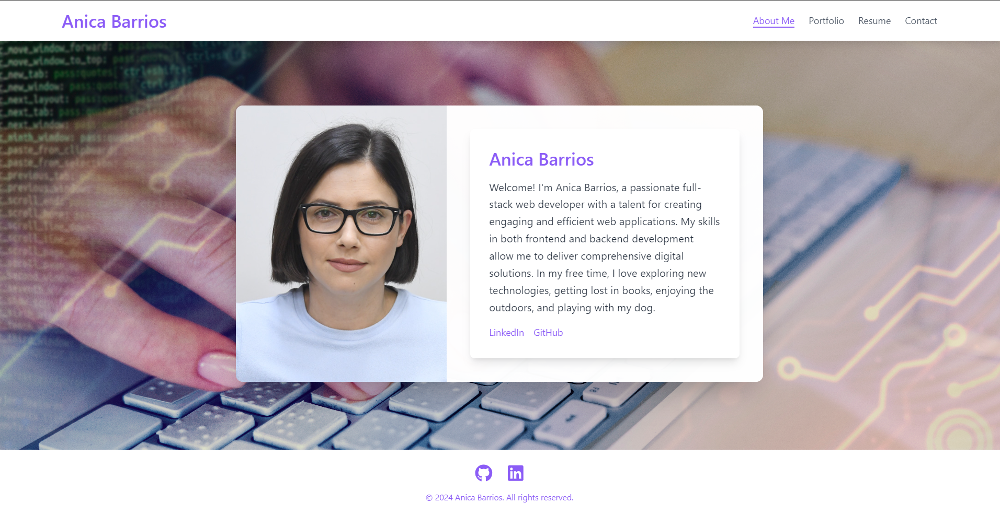
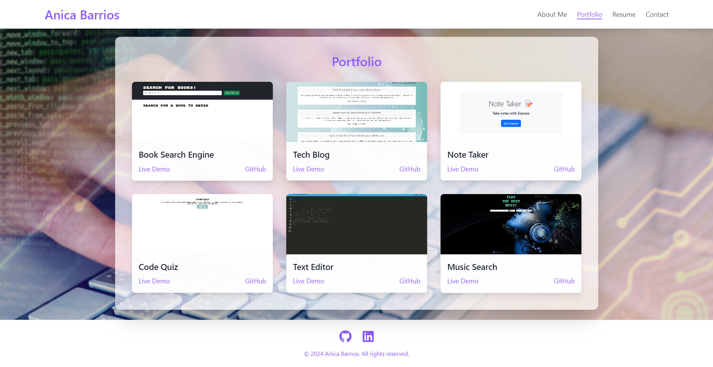
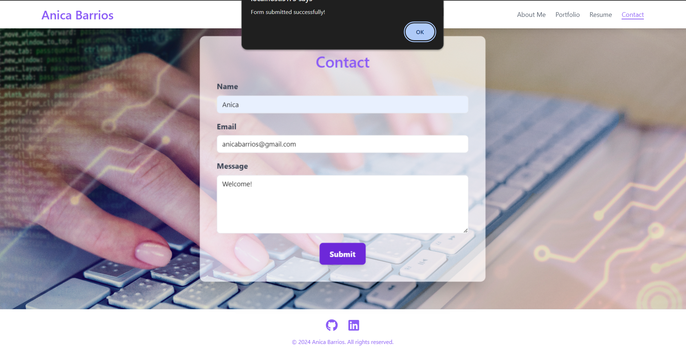

# Portfolio

## Table of Contents
- [Description](#description)
- [Mock-Up](#mock-up)
- [Getting Started](#getting-started)
- [Technologies Used](#technologies-used)
- [Live Link](#live-link)
- [Features](#features)
- [Contact](#contact)

## Description
Welcome to Anica Barrios' portfolio, a vibrant single-page application that captures my skills and experience as a full-stack web developer. This portfolio is thoughtfully designed with a modern header, various content sections, and a comprehensive footer. It provides a detailed look at my professional journey, highlights my impressive projects, and includes multiple ways to connect with me.

## Mock-Up
The following animation shows the web application's appearance and functionality:





## Getting Started
You’ll use `vite` to build your portfolio, which will include the following components:

- **Header**: A single `Header` component that appears on multiple pages.
- **Navigation**: A single `Navigation` component within the header that uses `Link` components from `react-router-dom` to conditionally render the different sections of the portfolio.
- **Project**: A single `Project` component that will be used multiple times in the Portfolio section.
- **Footer**: A single `Footer` component that appears on multiple pages.

### Installation
1. Clone the repository:
    ```bash
    git clone https://github.com/anicabarrios/Portfolio-React
    ```
2. Navigate to the project directory:
    ```bash
    cd Portfolio-React
    ```
3. Install dependencies:
    ```bash
    npm install
    ```
4. Start the development server:
    ```bash
    npm run dev
    ```

## Technologies Used
- Vite
- React
- React Router DOM
- Tailwind CSS

## Live Link
[Live Portfolio](https://main--portfolio-anicabarrios.netlify.app/)

## Features
- **Header**: Contains the developer's name and navigation with titles corresponding to different sections of the portfolio.
- **Navigation Titles**: Includes About Me, Portfolio, Contact, and Resume. The current section is highlighted.
- **About Me**: Displays a recent photo or avatar of the developer and a short bio.
- **Portfolio**: Shows titled images of six of the developer’s applications with links to both the deployed applications and the corresponding GitHub repositories.
- **Contact**: Contains a contact form with fields for name, email address, and message. Validation notifications for required fields and invalid email addresses.
- **Resume**: Includes a link to a downloadable resume and a list of the developer’s proficiencies.
- **Footer**: Provides links to the developer’s GitHub, LinkedIn, and Twitter.

## Contact

Feel free to reach out to me on any of the following platforms:

- **[GitHub](https://github.com/anicabarrios)**: See my latest projects and contributions.
- **[LinkedIn](https://linkedin.com/in/anica-barrios)**: Connect with me for professional networking.

I look forward to connecting with you!


